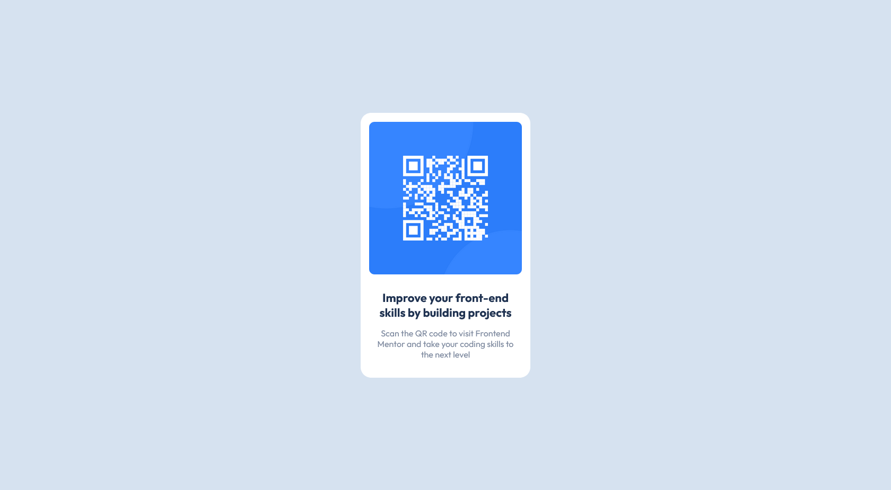

# Frontend Mentor - QR code component solution

### Screenshot

### Links

- Solution URL: https://github.com/chez199030/QR-code-component.git
- Live Site URL: https://chez199030.github.io/QR-code-component

### Built with

- Semantic HTML5 markup
- CSS custom properties
- Flexbox

### What I learned

I have learned about using vw and vh to maximize the width and heigth of container.
I also pratice my knowledge about using flex box and media query.

### Continued development

I want to practice more HTML and CSS before going to JavaScript specially CSS animation,Flexbox,CSS Grid and learning about doing project reponsive project mobile first.

### Useful resources

- https://stackoverflow.com/ - This helped me for vw and vh

## Author

- Frontend Mentor - [@chez199030](https://www.frontendmentor.io/profile/chez199030)
